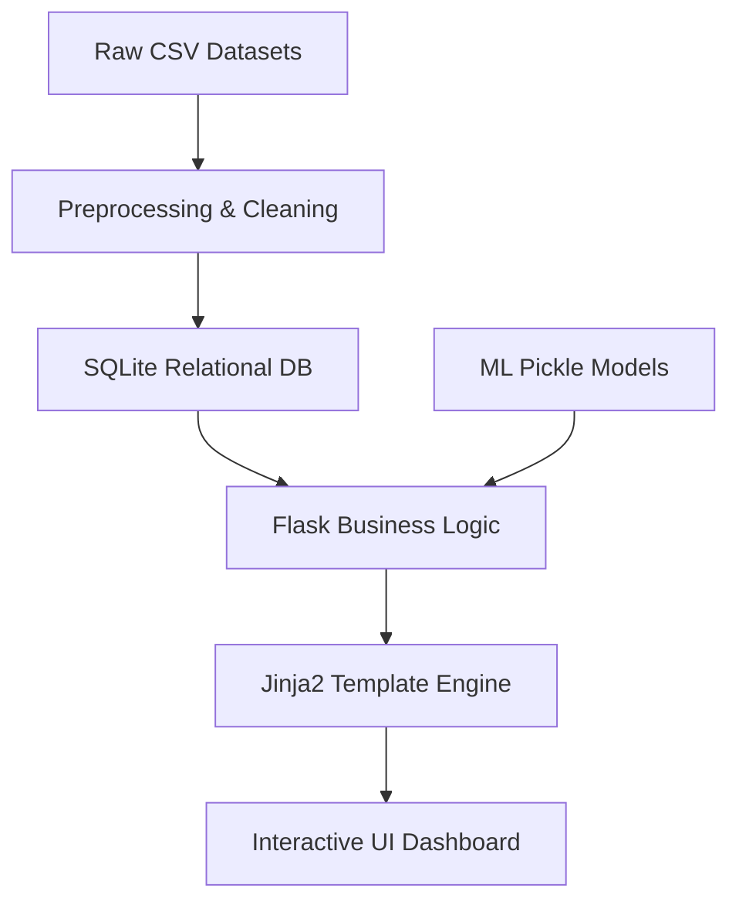

# RetailIQ Architecture & Data Flow

This document outlines the technical architecture of the RetailIQ platform and the flow of data across its subsystems.

## System Overview

The platform uses a layered architecture to keep machine learning decoupled from the frontend UI.

1. **Frontend Layer (UI & Presentation)**:
   - Built with Flask Templates (Jinja2), Vanilla JavaScript, and Chart.js.
   - Styling handled by a custom CSS system featuring a responsive Dark/Light mode Glassmorphism design.
   - Uses `localStorage` for state persistence (themes, sidebar state).

2. **Flask Layer (Routing & Logic)**:
   - Manages routing, user authentication (via `werkzeug.security` and `session`), and API endpoints.
   - Translates complex ML terminologies into business-friendly language before passing data to templates.

3. **SQLite Layer (Data Persistence)**:
   - Acts as the single source of truth for runtime state.
   - **`users`**: Authentication credentials.
   - **`customers`**: Core identity data.
   - **`transactions`**: Granular purchase history.
   - **`predictions`**: Cached ML results.
   - Calculates RFM (Recency, Frequency, Monetary) metrics dynamically via SQL queries rather than storing stale aggregate values.

4. **ML Layer (Predictive Analytics)**:
   - Contains pre-trained `scikit-learn` (KMeans, Random Forest) and `prophet` models saved as `.pkl` artifacts.
   - Uses `pandas` to process prediction rules and format forecast data.

---

## High-Level Data Flow

The following diagram illustrates how raw CSV data transitions into interactive dashboard insights.



## Prediction Pipeline Flow

When a user interacts with the system, or when data is imported, predictions follow a structured pipeline:

```mermaid
flowchart TD
    A[Customer Interaction / Transaction] --> B[Feature Generation (RFM)]
    B --> C{Machine Learning Engine}
    C -->|KMeans| D[Segmentation Model]
    C -->|Random Forest| E[Churn Model]
    D --> F[Assign Category 'VIP/Loyal']
    E --> G[Assign Retention Risk 'High/Low']
    F --> H[Store in SQLite 'predictions' table]
    G --> H
    H --> I[Customer Profile UI]
```
